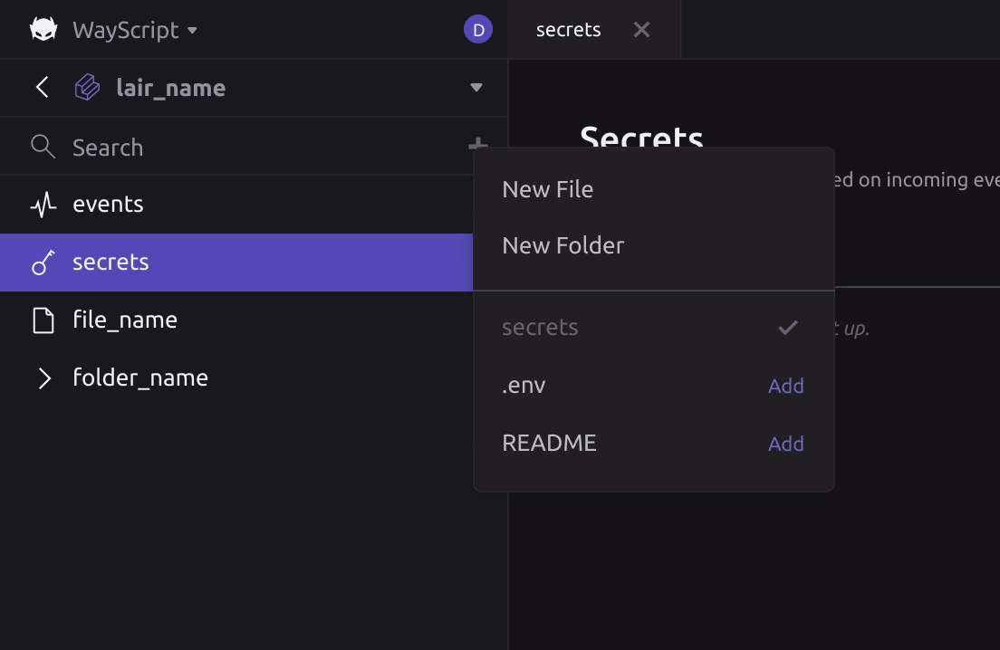

# File system

Each Lair comes with an attached file system that is fully encapsulated, i.e., cannot be accessed by files or processes within other Lairs. Each Lair is represented as a directory within the workspace, but modifying its contents is most similar to rebuilding a Docker image.&#x20;

### Example file system for your workspace

```
my-workspace/
├── my-lair-a/
    ├── .triggers
    ├── README.md
    └── my-file.py
└── my-lair-b/
    ├── src/
    |   └── my-app.py
    ├── .triggers
    └── .secrets
```

Files can be referenced by their relative or absolute path (starting from the Lair directory), and certain directories and files are protected, including:

* Lair directory
* `.triggers` file
* `.wayscript` directories and nested files

Additionally, you may not access files within other Lair directories from a selected Lair. Any files that need to be accessed by multiple Lairs should be served through an independent service.

### Completing file operations

**Create a new file or directory**

Create a file or directory within your Lair's file system by pressing :heavy\_plus\_sign: at the top.&#x20;



You can also upload a file or directory from your local device's file system by dragging it into your Lair's file system.&#x20;


Uploading large files or folders may take a few moments to complete. Do not navigate away from your current Lair until your upload is complete.&#x20;


**Editing files**

Select a file to open and modify its contents within WayScript's in-built editor.&#x20;


File edits do not auto-save; you must use `cmd+s` to save edits to your local device. You will see a :red\_circle: next to your file name if it has not been saved.


### Using file sync through the WayScript desktop app

When using the WayScript X desktop app, your file system exists in two places:

* **Remote** - on WayScript X’s managed infrastructure (or self-hosted, coming soon)
* **Local** - on your local device

The WayScript X desktop app creates and accesses files on your local device and then syncs those files to your remote infrastructure.


Both your remote and local file systems are connected to your Lair’s development environment. Please see [Hosted environments](../managing-tools/environments.md) for more details on your Lair’s environments.


**Setting up your file sync between remote and local**

On first launch of the WayScript desktop app, follow the prompts to choose a local directory to sync WayScript files between remote and your local device. Our tool will then create a new directory with the name of your workspace within the specified directory and download files present on remote.



Now that your WayScript files are present on your local machine, you can initialize `git` or other VCS on the workspace directory or for individual Lair directories to track changes or push to other remote locations. You can also clone repos directly into your workspace or Lair directories.


#### **Opening & saving files on local**

The WayScript X file system accesses your local files through the in-app file browser. You can open multiple files in a tab view and edit file content using the app's in-built text editor.&#x20;

#### **Fetching file system status from remote**

Pressing “Fetch” will evaluate whether there are changes that have not be downloaded from remote to your local machine. The app will also automatically “Fetch” before protected actions such as starting a new process or updating your integrations.

#### **Pulling file system from remote**

Pressing “Pull” will attempt to download files from remote to your local machine, based on the following rules:

* If the file has been modified or created in remote and NOT modified on your local machine, the remote file will replace your local file.
* If the file has been modified on your local machine, you will be asked if you would like to overwrite the local file with the remote file.

#### **Pushing file system to remote**

Pressing “Push” will attempt to upload your local machine’s workspace to replace your remote workspace. Currently, this function is not destructive, i.e., files deleted within your local machine’s workspace will NOT be deleted on the remote workspace.


Please do not modify `.wayscript` directories and nested files stored under your workspace root directory and Lair directories. These files are used for configuration or identification purposes and modification can lead to an unresponsive app state.

